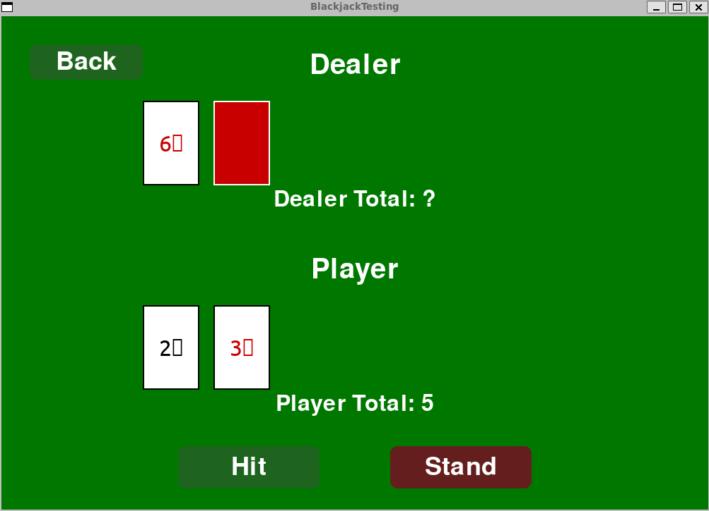
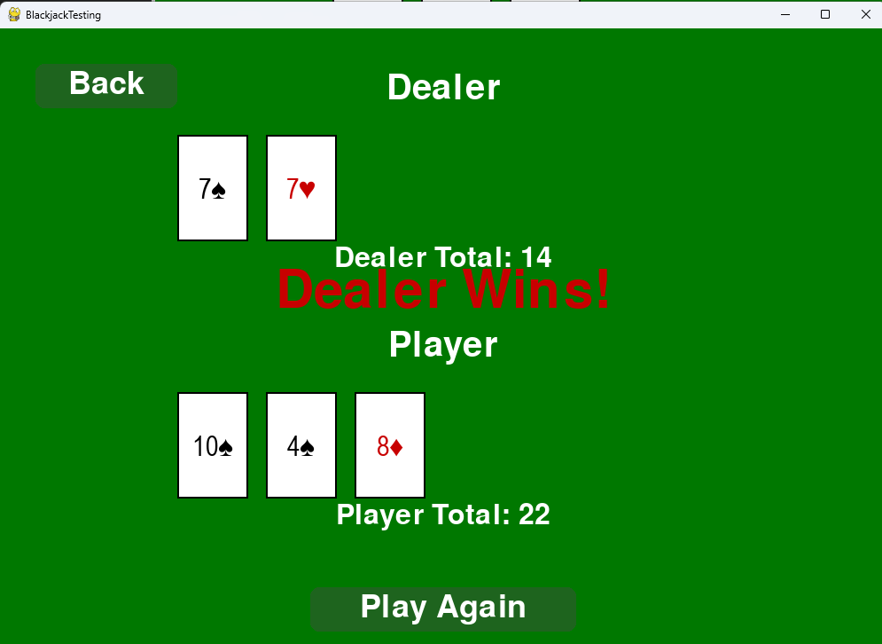
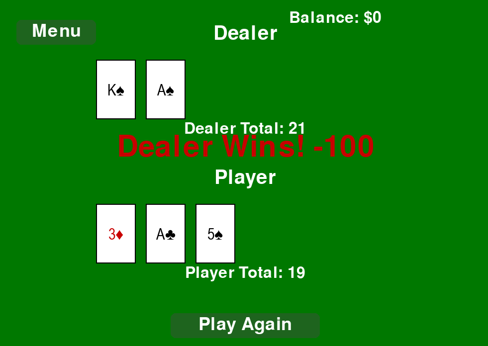

# 🃏 Blackjack (Pygame Edition)

A simple blackjack game built in **python** using the **pygame** library.
This version includes betting, full card drawing, hidden dealer cards, and hit/stand logic

## 🎮 Features

### **Main Menu**
- “Start Game”
- “Rules” section  
- Green table background

### **Rules Screen**
- Simple, readable rules  
- Back-to-Menu button  

### Betting
- Users can set how much to money to bet
- A win shows how much won

### **Gameplay**

- Full 52-card deck
- Clean white/red card graphics  
- Dealer’s second card is **hidden** until round ends  
- Player & dealer totals  
- **Hit** and **Stand** buttons  
- Dealer draws until total ≥ 17  
- Automatic win/loss logic  
- Displays:
  - **Player Wins!**
  - **Dealer Wins!**
- **Play Again** button  
- Back-to-Menu button  

---

## 🛠️ Requirements
- python 3.10 or newer  
- pygame library  

## 🕹️ How to run the game

1. Project folder should looks like this:
   CPSC-362-Blackjack/  
   ├── Blackjack.py  
   ├── CardFunctions.py  
   └── cards/

2. open a terminal or command prompt in the folder

3. run the game:
   python Blackjack.py

4. the game will open with:
   - a green background  
   - “Welcome to Blackjack” title  
   - Start Game and Rules buttons  

5. close the window or press X to exit.  

## 🖼️ screenshots

**Start Menu:**  

**Rules Screen:**  
  

**Loading Screen:**  

**Betting Screen:**  

**No money Screen:**  

**Gameplay:**  

|Game 1 | |
|-|-|
|  |  |
|  |
