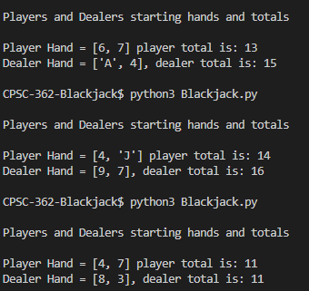
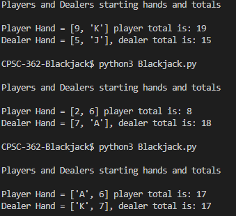
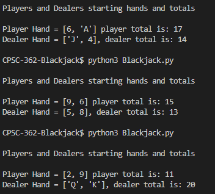

# CPSC-362-Blackjack
our blackjack project we're creating for cpsc 362

---

## project review (10/7/25)
**goals**
- implement main game loop  
- betting / money system  
- printing results  
- uml diagrams  

---

## current tasks
- main game loop (asking the player if they want to hit)  
- betting / money system  
- printing the results  
- uml diagrams  

---

## contributions

**Tristan**
- deck of cards  
- initial state of the game  
- deal two cards to dealer and player  
- use case diagram  
- activity diagram  

**Marvin**
- use case diagram  
- activity diagram  
- readme  

**Enoch**
- shuffling the deck of cards  
- calculating the player’s total and the dealer’s total  
- use case diagram  
- activity diagram  
- readme  

---
## Examples Screenshots

Inital Deal Examples

  
  
  

