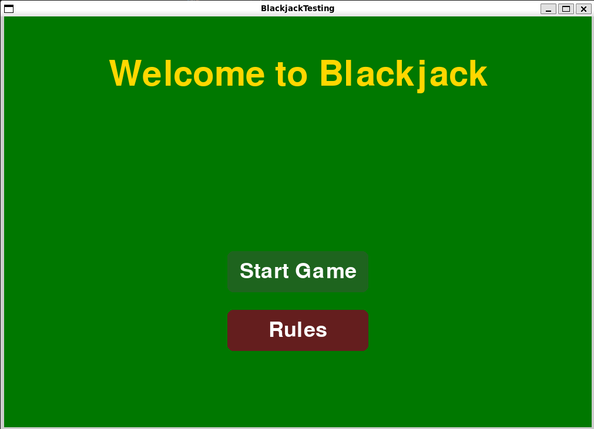
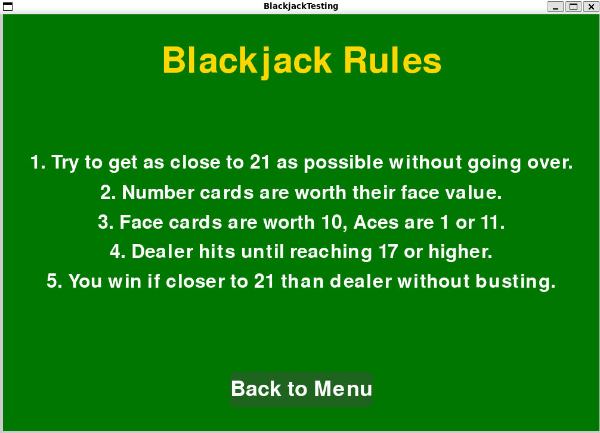
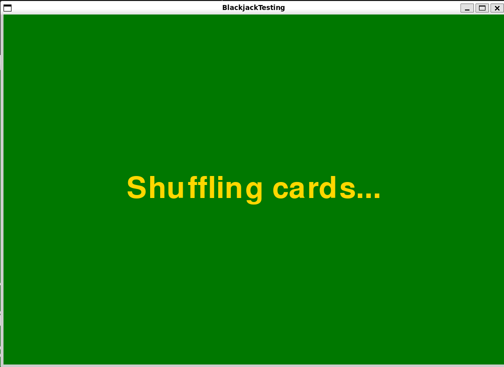
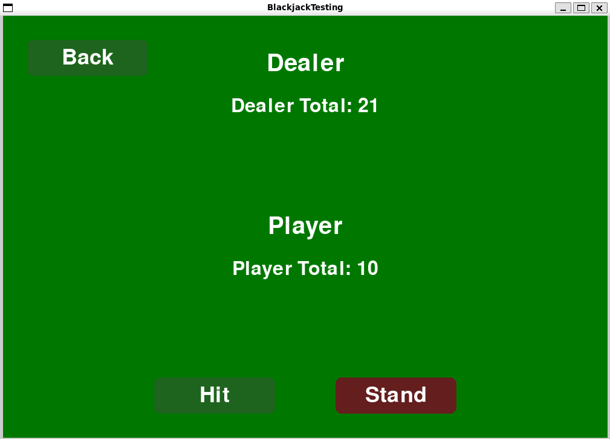

# 🃏 Blackjack (Pygame Edition)

A simple blackjack game built in **python** using the **pygame** library.
This project recreates the classic casino card game with a graphical interface and serves as a foundation for future gameplay development.

## 🎮 Current features
- start menu with **"Start Game"** and **"Rules"** buttons  
- **rules screen** with readable text and a movable **back button**  
- basic **state transitions** (`menu → loading → play → rules`)  
- green background with gold title text  
- simple, responsive UI design 

---

## 🧩 Planned features
- display player and dealer cards  
- add **Hit** and **Stand** buttons for player actions  
- implement dealer logic and win/loss conditions  
- show results screen (You Win / Dealer Wins)  
- add sound effects and animations  

---

## 🛠️ Requirements
- python 3.10 or newer  
- pygame library  

## 🕹️ How to run the game

1. make sure your project folder looks like this:
   CPSC-362-Blackjack/  
   ├── Blackjack.py  
   ├── CardFunctions.py  
   └── cards/

2. open a terminal or command prompt in the folder

3. run the game:
   python Blackjack.py

4. the game will open with:
   - a green background  
   - “Welcome to Blackjack” title  
   - Start Game and Rules buttons  

   Navigating to the rules screen shows a list of rules and a back button.  
   Start game will have a back button positioned in the top-left corner.

5. close the window or press X to exit.  

## 🖼️ screenshots

**Start Menu:**  

**Rules Screen:**  

**Loading Screen:** 

**Gameplay State:**  
